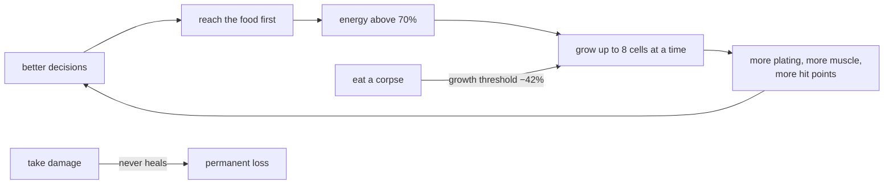

# CELLS

*A vivarium of cellular creatures — a real-time 3D simulation where every animal
is built one cell at a time, behaves according to what its body can actually
sense and do, and sings with a voice synthesised from its own genome.*

Two files. `cells.html` and `game.js`. No build step, no bundler, no
dependencies beyond three.js from a CDN. Open the page and the culture starts.

Live here: [https://mrqzzz.github.io/cells/](https://mrqzzz.github.io/cells/)

---


## What you are looking at

Three glass vessels — a wide **Tank** and two **Jars** — hold a population of
creatures made of spherical cells fused into a single continuous skin by
marching cubes. Nothing in the scene is a sprite or a canned animation. Every
body is a soft-body physics object of dozens to hundreds of cells held together
by distance constraints, and every gesture you see — a limb reaching, a body
recoiling, a tentacle tearing a piece off a rival — is the physics resolving
what the creature's muscles just asked for.

There is no scripted AI, no state machine deciding "now play the attack
animation". A creature attacks because an acid cell came within spitting
distance of a body it had classified as prey, and the acid does damage because
its spray reaches the target — no touch required. Take the acid cell away and
the same creature will still lunge, and still fail to hurt anything.

---

## The body: thirty kinds of cell

Cells come in seven families, and each one carries real numbers — mass, hit
points, armour, stiffness, upkeep — that the simulation actually uses.

| Family | Cells |
|---|---|
| **Nervous system** | brain, nerve, ganglion |
| **Senses** | eye, olfactory, ear, touch |
| **Organs and metabolism** | gastric, adipose, vascular, germ |
| **Motion and structure** | muscle, cilia, cartilage |
| **Defence** | epithelial, derm, keratin plate, horn spike, mucus, immune |
| **Attack** | acid, electric, sonic, gas, blunt plate, nettle |
| **Glands** | bioluminescent, pheromone, adhesive, ink |

Nothing is decorative. **Adipose** cells are an energy reserve that gets
cannibalised during starvation. **Vascular** cells cut the upkeep of everything
around them. **Immune** cells slowly repair damaged neighbours and charge energy
for it. **Mucus** makes a body slippery, which both neutralises acid and stops
enemies keeping their grip. A **germ** cell is what lets a creature bud at all.

---

## The genome

Seventeen genes plus a seed, encoded as a readable hexadecimal string you can
copy, paste, and hand-edit:

```
symmetry · cells per cluster · auto-restructure · defensive coverage
limb count · limb spread · limb curve · taper · body rigidity
growth rate · metabolism · aggression · fear · curiosity
pigment · cage shape · cage width
```

The genome does not describe a shape — it describes a **growth policy**. Body
plan, limb geometry, temperament, and the priority order in which a hungry
creature decides what to grow next all fall out of those seventeen numbers.
Two creatures with the same genes are the same animal; change one gene and the
body reorganises around it.

Twenty-four presets come with the simulation, grouped as **Predators, Prey,
Armoured, Extremes** and **Absurd** — from a minimal five-cell survivor to a
colossus, by way of several designs that have no business being alive.

---

## Why it looks alive

The behavioural realism does not come from one clever system. It comes from
several ordinary ones being honest at the same time, and from the fact that
none of them can cheat.

**Perception is physical.** A creature does not "know" where its prey is. Each
sense cell has a range, a field of view and a modality: eyes see shapes and
motion in a forward cone with excellent directional precision; the olfactory
cell smells organic matter much further away but can barely tell you where it
is; the ear picks up vibration and fast-moving bodies *outside* the field of
view, which is the only warning a blind creature ever gets; touch registers
contact and pain.

**And perception is late.** A percept does not reach the brain when it happens
— it is stamped with a delay proportional to how many synapses separate that
sense cell from the brain, and it only becomes available to the decision code
once that conduction time has elapsed. A long-necked creature with its eyes out
at the tip of a limb genuinely reacts more slowly than a compact one. Cells
that have been severed from the brain stop contributing entirely; the inspector
will tell you a cell is *disconnected*, and it means exactly what it says.

**Hunger is an accounting problem.** Every cell charges upkeep every second.
Energy comes from gastric cells digesting what the creature has actually eaten.
When the balance goes negative the creature starts consuming itself, cell by
cell, preferring its own fat reserves — and it shrinks while it does. A body
that is too elaborate for its stomach starves in front of you.

**Growth is triaged.** A creature with energy to spare does not grow at random:
it works down a priority list — vital organs first, then nerve coverage, then
enough muscle to move at all, then the structural cage, then the rest — so a
damaged body visibly rebuilds itself in a sensible order.

**Kinship is remembered.** A creature reproduces by budding, and for a while
after the birth mother and bud will not attack each other — not because a flag
blocks the damage, but because neither one enters the other's list of candidate
targets in the first place.

**Movement is inverse kinematics.** Limbs are chains that reach for a target
the brain has chosen. Muscles pull, cartilage stiffens, cilia paddle. A
creature with poor limbs does not swim badly in an animated way; it swims badly
because its chain cannot reach where it wants to go.

---

## Writing your own brain

Everything above describes the brain a creature is born with: a utility model
that weighs fleeing, hunting, feeding and wandering, holds a decision for a few
seconds so it does not dither, and hands orders to the limbs.

You can replace it with a JavaScript file.

Select a creature, then **Actions → Brain program → 🧠 BrainProgram…** and pick
a `.js` file — or just drop the file straight onto the creature. From that
moment your code decides for that body, sixty times a second, and the
inspector's **Deciding** row says so. **■ Stop** hands it back.

The program declares one function:

```js
function think(bot, dt) {
  const prey = bot.remember('prey', bot.easiestPrey());
  if (prey && bot.inReach(prey)) bot.attack(prey);
  else if (prey)                 bot.chase(prey, 1);
  else                           bot.wander(.5);
}
```

What it replaces is the *decision*, and only that. The file is compiled once
per creature — so its top-level variables are that creature's private memory —
and it reads the same delayed, partial, ink-blinded percepts the built-in brain
reads. It cannot see through walls, and it cannot fire a weapon: it chooses a
state, a heading and a target, and the body does what a body does. Acid keeps
leaking on its own, ink comes out because you chose to flee, a blunt plate hurts
in proportion to how fast you swung it.

Errors are survivable. An exception is printed to the browser console and the
built-in brain takes that one step; six in a row and the program is detached.

And you can watch it think. **Shift-click a creature that is running a
program** — or press **🐞 Debug** — and its program opens in a movable,
resizable editor beside the vessel, focused and flashing so you can tell which
one it is. There is one panel per creature, so two duelling brains can be
watched side by side: a green bar flashes down the gutter next to each line as it runs,
so you see the path the brain actually takes frame by frame; click a line
number to put a breakpoint on it and the whole simulation stops there, with the
local variables — read from the live scope, not reconstructed — listed on the
right. Every exception lands in a console under the editor with the line it
came from, folded into one entry with a counter rather than sixty a second.
Fade the panel down with the ◑ slider and you can watch the creature through
its own code. Edit, press **Apply**, and it is thinking with the new code
without ever reloading the page — or drag the **◎** target onto another
creature to hand it the same brain and watch the two diverge.

It can also read bodies and rearrange its own. `bot.scan(enemy)` returns the
opponent's whole body as a tree — every cell with its type, its armour, which
limb it sits on and **how many cells deep it is buried** — so a program can
tell the difference between an enemy that has acid and an enemy that has acid
on the tip of its third tentacle, and can spot a brain close enough to the
surface to be worth going for. `bot.tree()` returns your own body in the same
shape, and `bot.restructure(tree)` puts it back together following it: since
[armour protects what is behind it](#armour-is-somewhere-not-just-something),
moving the plating outward and the organs inward is a real defensive gain.

The nodes of that tree are read-only where it matters: `type`, `id`, `hp`,
`armor` and the rest are getters, so an attempt to edit one throws on the line
that made it rather than being silently ignored, and the node is sealed, so
even a mistyped name is caught. Only `children` — what attaches to what — can
be written, because that is the plan rather than the body. Limbs are read off
the shape — a limb starts where a muscle hangs off something that is not a
muscle — so moving a branch takes its limb with it, and detaching half a
tentacle makes it a limb of its own. And a rebuild that changes nothing costs
nothing: cells whose parent is unchanged go back exactly where they were. Identity therefore survives a
rebuild by construction: every node goes back to its own cell, wounds included.

A rebuild cannot create anything. It must contain **exactly the cells the body
already has** — same types, same counts — so it is a rearrangement, not a
shopping list: no conjuring armour, no dropping dead weight, no turning a
muscle into a plate, and no borrowing a cell from another creature. Wounds
travel with the cell, so nothing is healed by it either. It costs energy and
has a cooldown.

The full API — the body, the cells, the limbs, perception, memory, the
commands, the event hooks and a worked example — is documented in
**[BrainProgram.md](BrainProgram.md)**, written so that a language model can
produce a working creature brain from it alone. A commented starting point
ships as [`BrainProgram.example.js`](BrainProgram.example.js).

---

## Attack and defence: an interaction, not a table

Six weapons, and none of them is a re-skin of another. Each has its own damage
model, its own delivery, and its own visible effect on the victim.

| Weapon | How it works |
|---|---|
| **Acid** | Spray damage in a 0.2–0.8 m band, nothing at point blank — in 2-second bursts, then 4 seconds to recharge. No contact needed: it ignores part of the armour and dissolves bonds. It spreads: the corroded patch creeps to neighbouring cells while the spray keeps landing. |
| **Electric** | An area discharge that damages and *stuns nerve conduction* — a stunned creature literally stops thinking straight — and throws the victim away from the point of entry. |
| **Sonic** | A ranged shock wave in a cone. Moderate damage, but it disorients anything with ear cells and sends the victim tumbling out of control. |
| **Gas** | A toxic cloud that poisons and slows whatever crosses it — puffed in 2-second bursts, then 2 seconds to recharge. |
| **Blunt plate** | Damage proportional to impact speed — useless on a stubby body, devastating on a long powerful limb. |
| **Nettle** | Nematocysts: on contact they inject venom that keeps damaging long after the tentacle has let go. |

Defence composes, and it composes *in space*. **Effective armour is not a
property of a cell**: it is worked out from the plating that surrounds it, and
resolved against the side the blow arrives from. A keratin plate does not just
protect itself, it shields whatever is behind it. The whole of that — with the
numbers, and with what each damage type does to armour — is in
[What kills what](#what-kills-what-weapons-armour-and-shape) below.

### Every attack has its own reaction

You can tell what is happening to a creature without reading a single label,
because each attack produces a distinct, physically-driven response:

- **electric** — a shock wave runs through the body cell by cell, the creature
  flashes blue and is flung away from the discharge;
- **sonic** — it tumbles out of control around a random axis, and the wave
  itself is drawn as a quarter-sphere cap pointing the way the blow travelled;
- **gas** — it curls in on itself, pulling limbs and organs toward its own
  centre, and blanches;
- **acid** — a green stain spreads across the side that was hit, and it goes
  slack;
- **nettle** — the body stiffens and shivers at high frequency, bristling.

The colour reactions are deliberately *late*: the damage lands the instant the
hit connects, but the visible stain waits until the particles have actually
crossed the distance and arrived. Cause before effect, even for something that
takes two tenths of a second.

---

## What kills what: weapons, armour and shape

Everything below is read off the simulation, not off a design document. The
numbers are the ones in `CELL_TYPES` and `damageCell`, and the fight results
are measured, with identical bodies on both sides unless stated.

### The six weapons

| cell | reach | damage | rhythm | delivery | what it really does |
| --- | --- | --- | --- | --- | --- |
| **Acid** | 0.2 – 0.8 band | 17 /s | 2 s spraying, **4 s recharge** | **automatic** | dissolves bonds: `corrosion` kills the shape memory, so the victim's limbs stop swimming and the body goes limp. Nothing at point blank |
| **Gas** | 1.1 radius | 7 /s | 2 s puffing, **2 s recharge** | **automatic** | poisons, slows for 0.5 s, and the victim curls up |
| **Electric** | 1.4 radius | 16 per shot | **2.2 s cooldown** | needs `attack` | **stuns for 1.6 s — and a stunned creature's brain is not called at all.** It does not damage a program, it switches it off |
| **Sonic** | **2.6 radius**, 0.9 rad cone | 11 per shot | **2.8 s cooldown** | needs `attack` | the longest reach in the game; stuns ear cells for 0.8 s and sends the victim tumbling for 0.95 s |
| **Blunt plate** | contact | up to 34 | 0.75 s cooldown | contact | **scales with impact speed** — below 0.9 it does nothing at all. It has to be swung, not leaned on |
| **Nettle** | contact | 5 + venom 9 | 0.5 s cooldown | contact | the venom keeps burning after contact ends, and the victim stiffens for 1.1 s |

The burst clocks of acid and gas only run **while something is in range**, so a
creature never wastes its charge on empty water.

Two of these need no permission from the brain. Acid and gas leak at anything
hostile inside their band whatever the creature is doing, which makes simply
*standing in the right place* a complete tactic. Electric and sonic fire only
while the creature is in the `attack` state — which is why a program can own
twelve electric cells and never use them.

### The four senses

Nothing here queries the world. Each sense cell has a reach, a cone and an
accuracy, and what it reports arrives **late** — delayed in proportion to how
many synapses separate it from the brain, so a sense out on a long limb really
does react more slowly than one in the core.

| sense | reach | cone | accuracy | what it is for |
| --- | --- | --- | --- | --- |
| **Eye** | 5.5 | 1.15 rad, forward | exact | shapes and motion, precisely, in a narrow cone |
| **Olfactory** | 8.0 | π, nearly all round | ±0.39 × distance | the longest reach and the vaguest: it finds food, but not exactly where |
| **Ear** | 9.0 | 2.6 rad, very wide | ±0.24 × distance | **only hears what is moving or loud** — and hunting or fleeing makes you loud |
| **Touch** | 0.35 | all round | exact | contact and pain; the reflex sense, and the one ink cannot fool |

That third row is the whole of stealth here. A creature in `hunt` or `flee` is
audible to ear cells anywhere in range, in or out of their cone; every other
state is quiet. Crossing the tank in `wander` instead of `hunt` costs nothing
and stops ears from tracking you.

### The six defences

Each one carries three separate defensive numbers, because plating, insulation
and chemical barrier are three different jobs. **Armour** is subtracted from
every blow; **insulation** is what a discharge has to get through; **barrier**
is what acid has to eat through. A plate is a poor insulator's opposite — dry
horn stops current — and mucus, which is nearly worthless as armour, is the
best thing in the game against acid.

| cell | armour | insulation | barrier | what it adds |
| --- | --- | --- | --- | --- |
| **Keratin plate** | 0.62 | **1.00** | 0.35 | the heaviest plating; stiffens whatever it grows on |
| **Derm** | 0.40 | 0.65 | 0.55 | thick and cheap |
| **Horn spike** | 0.35 | 0.55 | 0.20 | wounds whatever touches it (9 damage) and punches through armour |
| **Epithelial** | 0.22 | 0.30 | 0.60 | continuous covering; closes the body |
| **Mucus** | 0.08 | 0.20 | **1.00** | neutralises corrosives and stops enemies keeping their grip |
| **Immune** | — | 0.10 | 0.55 | the only healing in the game: repairs damaged neighbours within 0.55 |
| **Ink** | — | — | — | released while fleeing or in pain: blinds enemies for 2.5 s **and hides whoever let it go** for 3.6 s. 2 s to recharge |

Defence cells are built at **0.7 of the size their sheet gives** — the factor
lives in one place, where a cell's radius is born, and applies to the whole
`defense` family and to nothing else. Cartilage is not in it: cartilage is
skeleton, and it is the arc the cage is built on.

Along a chain they then **taper to a point**: each ring is a linear step
thinner than the one before, down to **0.28** of the base cell at the tip — a
five-ring chain runs 1.00, 0.82, 0.64, 0.46, 0.28. A chain is a horn, not a
tube. It costs length, because a step is as long as the cells that make it and
smaller cells cover less ground with the same number of rings, so cages close a
little less than they would with blunt chains. That is the trade, taken
deliberately in favour of the shape.

#### Ink: the only cell that hides you

A cloud in the water does not just blind whoever swims into it — it hides the
animal that made it. For the 3.6 seconds a cloud lasts, its owner is very hard
to perceive, and **cannot be read at all**: `bot.scan()` returns nothing for a
creature inside its own ink, so a program cannot see what weapons it carries,
where its brain sits, or how deep anything is buried. Short-term memory stops
tracking it too — you remember the last place you saw it, not where it is now.

It is not a cloak of invisibility, because a cloud does different things to
different senses:

```
  chance a sense FAILS to find a creature inside its own ink
  eye      96%  ████████████████████████████████████████▏
  smell    88%  ████████████████████████████████████▏
  hearing  55%  ███████████████████████▏
  touch     0%  ▏
```

Measured over 15 seconds against a hunter with the standard sense kit, smell
goes from finding it **100% of the time to 14%** — and what gets through is
not a flicker but five glimpses of about four tenths of a second each. Against
a hunter that has invested in **ear cells**, though, the same cuttlefish is
still located 54% of the time, because fleeing makes you loud and sound
travels through a cloud. Touch never loses it at all: if you run into it, you
have found it.

So ink beats sight and smell, and is beaten by ears and by closing to contact.
A creature that spams it is also a creature that is permanently in the `flee`
state, which is to say permanently not attacking.

That last row of the table decides more fights than it looks. **Without immune
cells damage never comes back.** Every point of health lost is lost for the rest of the
match, which is why a favourable exchange rate matters more than a big hit.

### How much armour is worth, and against what

Armour is not one number applied to everything. In `damageCell` each damage
type keeps a different fraction of it, and two of them then meet a **second**
defence that plating has nothing to do with:

```
                    armour kept    then                fraction that lands
  acid   ▏×0.55     ███████████    × (1 − barrier)     0.60  █████████████████████████▏
  shock  ▏×0.45     █████████      × (1 − insulation)  0.65  ███████████████████████████▏
  venom  ▏×0.55     ███████████    —                   0.73  ██████████████████████████████▉
  blunt  ▏×0.45     █████████      —                   0.78  ████████████████████████████████▊
  pierce ▏×0.45     █████████      —                   0.78  ████████████████████████████████▊
  starve ▏×0        ▏              —                   1.00  ██████████████████████████████████████████
```

Measured on the Boulder's brain, whose surrounding defence is worth 0.21 of
insulation and 0.17 of barrier.

`shock` is the electric discharge. It used to be typed `blunt` like a hammer,
and that is still how the plating treats it — a keratin plate is not what stops
current. What stops current is **dry tissue between you and it**, which is why
the discharge now has a name of its own: the armour rule is unchanged, but
insulation knows to intervene. The sonic wave goes through the same function
and stays `blunt`: it is pressure, not current.

Venom covers both the nettle's lingering poison **and the gas cloud** — both
are typed `venom` — so a body that ignores gas is a body that has misread the
same rule twice. Neither gets the barrier: it is tuned for acid, and gas is a
different problem. Only starvation ignores plating completely, and that one is
the body eating itself.

Both extra channels **saturate and are capped at 30%**: the twentieth plate is
not worth what the first was, and no body becomes immune. What they buy,
measured with the same blow against two creatures:

```
  damage that actually lands
                    armoured body (86 defence cells)   Jolt (6 epithelial)
  discharge  11.4   7.41  ███████████████████████▏     10.83  ██████████████████████████████████▏
  acid       10.0   6.00  ██████████████████▉           9.30  █████████████████████████████▍
```

### Armour is somewhere, not just something

A plate protects what is behind it. Every cell carries six numbers — how much
armour lies around it in each direction of the body — worked out from the rest
pose whenever the body changes, and a blow is resolved against the side it
actually arrives from.

**A cage protects a volume, not a contact.** The reach of that shielding is the
**trunk**: the rest-pose radius of the body with the limbs left out, plus 15%,
never below 0.55. Within it the weight of a plate falls as `1 − (d/R)²` — flat
close by, still half of its value at half a body away, zero at the edge.

That curve replaced a contact model — a fixed 55 cm and a weight falling as
`1/d` — which was written when plates lay directly on the organs. It stopped
describing the game the moment the cage became a **standing structure** made of
chains: on a creature with defensive coverage at maximum, 39 plates in all and
only 10 of them inside the old radius, keratin 2 out of 10. Its brain carried
0.14 of armour with 86 defence cells wrapped around it. The same brain, same
body, under the volume rule: **0.31**. The limbs are left out of the radius on
purpose — two long arms were inflating the shielding of everything else, and an
arm is not a cage.

Measured on the Boulder, a hundred cells of which fifty-six are plating:

```
  effective armour, same creature, same plates
  body average              0.58  ████████████████████████▏
  brain, inside the cage     0.41  █████████████████▏
  cell out on a limb         0.29  ████████████▏
```

Those are **isotropic** averages — how much armour is around, not which way it
faces — and read alone they suggest a limb is now half as safe as the core.
It is not, because the direction is applied at the moment of the blow: struck
from outside, that limb tip takes **98% of the hit**. A cell's own side-by-side
numbers swing its armour by anywhere from **−85% to +160%** of its average,
which is the whole of it — the plating is either between you and it, or it is
not.

### So does the biggest creature just win?

No. Isolating one variable at a time, three fights:

**Size alone — same program, same genome, one body scaled ×1.8: two wins each.**
Upkeep scales almost exactly with cell count, so the big body pays for its hit
points every second:

```
  upkeep, per second        energy left after 20 s
  big  (135 cells)  2.61 ████████████▏      0   ▏
  small (75 cells)  1.49 ███████▏          16   ████████▏
```

At zero energy a creature eats one of its own cells every 1.6 seconds. Size
wins the short fight — more hit points, and the brain buried deeper where the
shielding is thickest — and loses the long one.

**Weapons — yes, and by delivery more than by damage.** A wall of plating beats
a discharge and dies to a cloud:

```
  Boulder (56 plates, no weapons) versus …
  Electric  ▏ Boulder wins   1.32 hp vs 0.44 hp     — burst, 2.2 s between shots
  Acid      ▏ Boulder loses  0.36 hp vs 1.38 hp @29s — 17 /s, continuous
  Gas       ▏ Boulder loses  0.39 hp vs 1.57 hp @17s —  7 /s, continuous
```

Against a large pool of hit points a weapon that never stops beats a weapon
that hits hard every two seconds, whatever the armour table says.

Those three were measured **before insulation and barrier existed**, and both
of them push the same way: the Boulder now keeps 21% of the discharge off its
brain and 17% of the acid, so it wins the first line by more and loses the
second by less. Single duels in this game are noisy enough — the same pair
run twice can differ by a factor of four in time-to-kill — that the ordering
is what to trust here, not the decimals.

**Strategy — the largest effect of the three.** Identical bodies, two different
programs, fifteen duels: **11 wins, 3 losses, 1 draw**, six kills to one, and
an average of 116 cells left standing against 72. The clearest single
measurement of why:

```
  a creature with 12 intact electric cells,
  39.1 seconds spent standing next to its enemy:

  in `feed`    37.9 s  ████████████████████████████████████████▏
  in `attack`   1.2 s  █▏
  discharges fired: 43 of roughly 213 possible
```

Electric fires only in the `attack` state. The weapon was loaded, undamaged
and in range for the whole fight; the program simply never granted the state,
because "eat when hungry" sat above "shoot" in its list of priorities. It used
a fifth of what it was carrying while being taken apart.

### Food: the only thing that pays for any of it

Food is dropped into a vessel by hand — the **💧 Food** button at the bottom
right, or the **F** key — and it does not appear on its own. A free morsel
carries 22 to 38 energy; a cell knocked off a body turns into one worth 8 to
15, where it fell; a whole corpse is worth more still — **1.52×** the energy
per second, and twice the push to grow for every mouthful.

Gastric cells absorb whatever drifts within 0.30 of them, at 11 per second
each. That happens whatever the creature is doing — but a creature that has
*decided* to feed puts its limbs on the morsel and carries it to the stomach,
which is several times faster.

Energy is not a health bar. It is a budget, and it is spent whether or not
anything is happening:

```
  every cell charges upkeep, every second
  a body 1.8× larger costs 1.75× more to keep alive

  at zero          eats one of its own cells every 1.6 s
                   (fat first, giving back 20 each — then the rest)

  above 70% full   builds new cells, up to 8 at a time
  after a kill     that threshold drops by up to 42%,
                   and the wait between spurts by up to 60%
```

So the loop closes: eat, exceed 70%, grow, and be harder to chew through than
you were. And since **damage never comes back** without immune cells while
energy always does, a morsel is usually worth more than a poke — the poke
does damage the enemy will pay off with its next meal, the morsel becomes
cells that never go away.

That is why an empty vessel is a slow death sentence for everything in it, and
why throwing food in is the single lever that most changes what happens next.

### The loop that decides long fights



That is the whole economy. Winners in these duels do not finish bigger because
size wins; they finish bigger because the chain above ran in their favour, and
the size is the scoreboard rather than the cause.

---

## The sound

Every creature has a voice, and that voice is **synthesised from its genome**.
Nothing is a sample. There is not a single recorded sound in the project.

### Thirteen families of call

The genome picks an archetype — a family of animal voice — and the archetype
sets spectrum, formants, breath, tremors and attack *together*:

> `human` · `gurgle` · `whale` · `mammal` · `feline` · `roar` · `trumpet` ·
> `croak` · `insect` · `bird` · `predator` · `saurian` · `guttural`

The draw is weighted, not determined: aggression makes roars and saurians more
likely, a fast metabolism makes insects and birds, rigidity and slowness make
whales. But two identical predators can end up one a roar and the other a
trumpet, because a bestiary whose voices can be deduced from the statistics is
a boring bestiary.

It is the *combination* that sounds like an animal. Picking each parameter
independently at random always produces a synthesiser.

### Why it does not sound electronic

Three things separate a synthetic voice from a living one, and all three are in
here.

**The waveform is built, not chosen.** Instead of the browser's four stock
oscillator shapes, each creature gets three `PeriodicWave`s constructed harmonic
by harmonic from its archetype's spectral profile — and the three are
deliberately different from one another: one round, one carrying the family
character, one rough.

**The pitch never sits still.** A four-second random-walk buffer drives the
oscillators' detune. This is not an LFO — it has no period, and that is the
entire point, because periodicity is what betrays the machine. Measured on an
isolated oscillator, the fundamental wanders by about 18 cents where a bare
oscillator wanders by 0.1. Each family has its own amount: a whale is steady at
4.7 cents of standard deviation, a roar unstable at 21.7, a gurgle at 28.7.

**There is breath.** Filtered noise, mixed *before* the formants so the same
mouth shapes it, at a level the archetype decides.

On top of that the timbre moves while the note holds: three amplitude wobbles
at incommensurable rates continuously re-mix the three waves, three more move
the formants and the veil filter, and each of those six has its own slow
modulator changing its speed — because an LFO at constant rate can eventually
be counted, and the moment it can be counted you hear the machine. On a
sustained note the spectral centroid roams across a 64% range.

### It is a choir, not a crowd

Every voice reads the same clock. The phrase is exactly **16 steps — one bar of
4/4 in sixteenths** — and each creature's note-and-rest pattern is generated
from its genome to fill that bar exactly. Notes are short (52% of them last a
single sixteenth); rests are free to run long. A creature is actually sounding
about 20% of the time.

Nobody conducts and nobody sends messages: each voice reads the audio clock,
divides, and knows where it is. Measured over thirty seconds of five voices,
118 note attacks landed with **0 ms** of deviation from the grid, and 17 moments
had several creatures starting together. Metabolism can put a creature in
half-time or double-time, which stays aligned because halves and doubles of a
sixteenth are still positions on the grid.

### The voice follows the body

- **Size sets pitch**, counted on *living* cells every frame, so a creature
  gets deeper as it grows. Measured on one creature: 531 Hz at ten cells, 188 Hz
  at seventy-five.
- **Speed and pain raise it.** A creature fleeing while being savaged sings a
  full octave above the same creature drifting.
- **Damage detunes it.** Stunned, poisoned or curled up, the voice sags and
  dirties.
- **Change the DNA and the voice is rebuilt**, immediately — a seventeen-gene
  fingerprint detects any edit, whether from a slider, a pasted genome string,
  a mutation or the dice.

### Every event has its own synthesis

- **Attacks** — acid *fries*, hundreds of tiny bubble-pops per second written
  sample by sample; the electric discharge is an arc that stutters, broken into
  irregular on/off fragments because a real arc breaks and re-strikes hundreds
  of times a second; sonic is a **scream** built from a subharmonic, a detuned
  twin and eighteen irregular pitch jumps, because a real scream is an
  oscillation in crisis; nettle is a blade going in — the metallic edge, the
  thrust growing duller as it enters, then flesh opening.
- **Pain** — the creature's own voice, wrung out, pitched by its size.
- **Death** — that same cry taken to its conclusion: it rises, holds, then falls
  an octave and a half without ever recovering while the tremor slows into a
  rattle, and ends on a last breath.
- **Tearing** — a cell being ripped away is not one sound but a hundred tiny
  ones in a row: tension, then fibres letting go in an avalanche, then the snap,
  then the last few giving way late.
- **A blow** — flesh does not ring. The slap, the wet displacement of soft
  tissue, the weight; all of it over in under a tenth of a second.
- **Eating** — a two-beat swallow: the throat closes and pushes, then reopens.

Everything is placed in space — distance, direction and the vessel you are
looking into. Look into a single vessel and the other vessels go silent.
**Hover a creature and you hear it alone**, with its phrase drawn as a
sixteen-column graph in the creature's own pigment, lit column showing where it
is in the bar.

---

## Running it

Serve the directory over HTTP and open `cells.html`:

```bash
python3 -m http.server 8765
```

Then visit `http://localhost:8765/cells.html`. It needs a browser with WebGL2
and Web Audio; sound starts on the first click, as browsers require.

### Keys

| key | what it does |
| --- | --- |
| `Space` | pause and resume |
| `N` | a new creature from the genome on the right |
| `F` | drop five pieces of food in the active vessel |
| `M` | cycle the rendering mode |
| `Del` / `Backspace` | **with Edit off**, removes the selected creature from its vessel; **with Edit on** and a cell circled, removes that one cell instead |
| arrow keys | with Edit on, walk the parent–child tree from the circled cell |

The delete key has two targets on purpose, and the mode decides which: with
Edit on you are taking a body apart cell by cell, with it off you are running
the vessel. It does exactly what the inspector's **☠ Delete** button does, and
writes a line in the log — from the keyboard there is no button press to show
it was meant.

## The panels

**Cells** — the palette; click or drag a cell onto a creature to graft it.
**📘 AI docs**, in a creature's *Actions*, opens
[BrainProgram.md](BrainProgram.md) inside the app, with a button to copy it or
download it: that is the file you hand to an AI model when you want it to write
a brain.
**Creature & DNA** — the genome of the next creature, the presets, and the
inspector for whatever is selected. **Materials**, **Skin**, **Glass** — the
look, with everything persisted to local storage. **Sound** — three faders, who
you are currently hearing, and the phrase of the isolated creature. **Status**
and **Vectors** overlay the labels and the senses.

A creature's *Actions* also carry **👁 POV**: a toggle that puts the camera
at the creature's own muzzle — just ahead of it, so its body is behind you —
looking where its brain has chosen to go, the same arrow the **Vectors**
overlay draws — from close inside its body, at the height of its centre, so
the horizon sits level. A banner up top names who you are following, its state and its energy, and
stays clickable so you can always leave POV from there. The camera is kept
inside the vessel walls. Double-click empty water to leave, or another creature
to jump to it; a vessel button releases it too. The view turns toward
whatever matters right now, not just the way it is swimming: the enemy it is
fighting, whoever is attacking it, the morsel it is eating, or a prey it has
just noticed — falling back to its heading when nothing stands out. The field
of view widens to 120° so you are inside the scene rather than watching it. That choice flickers many times a second, so the camera does not chase
it directly: it turns toward a heavily smoothed direction (about a 0.9-second
half-life), gliding while the creature darts. Press it again — or let the
creature die — and the lens narrows back to normal and the camera eases well
back behind the body it was following.

Along the bottom: one button per vessel, and on the right **+ Jar** to add
another and **💧 Food** to throw a handful of morsels into whichever vessel is
active — the **F** key does the same. Nothing eats unless you feed it, so that
button is the main thing that decides whether a vessel thrives or starves.

Hover any cell for the full readout: hit points, effective armour, distance
from the brain in synapses, and how many cells the whole creature is made of.
